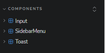
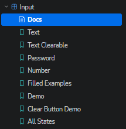
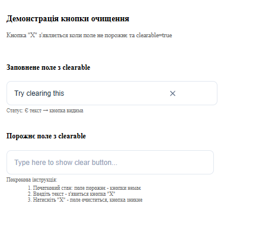
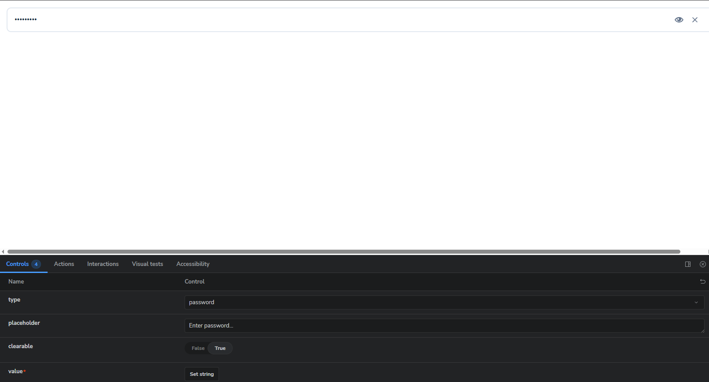
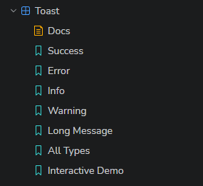
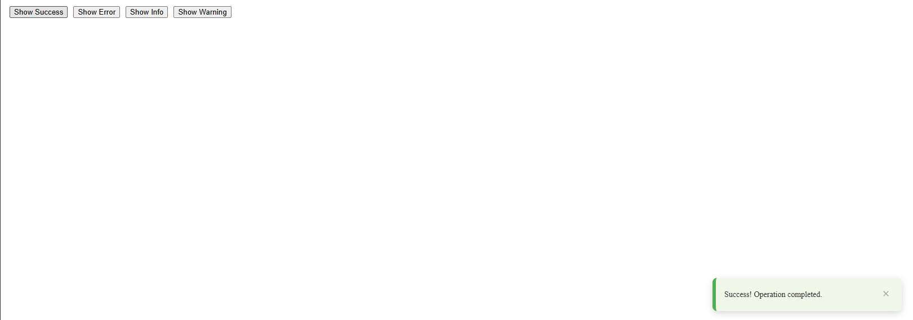
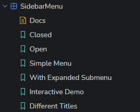
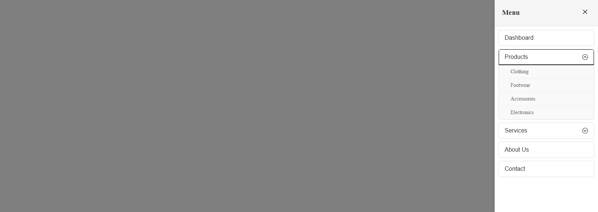
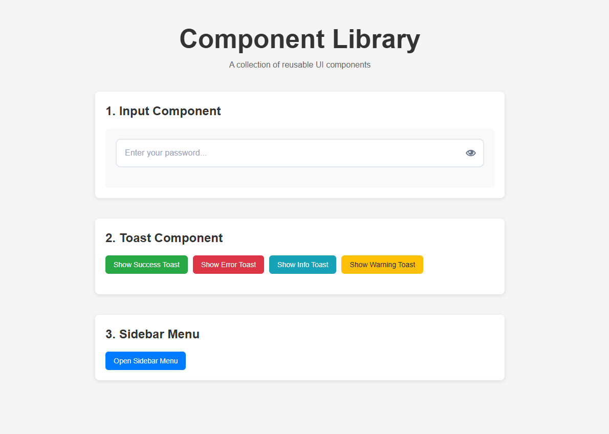

# 📚 React Component Library with Storybook

## 📋 Про проект

Ця бібліотека компонентів React містить три
перевикористовуваних UI-компонента з різними станами та
пропсами. Проект побудований на сучасному стеку технологій
(Vite, TypeScript, CSS Modules), а всі компоненти
задокументовані та візуалізовані в **Storybook**.

---

## 🎯 Компоненти

### 1\. Input Component

Розумний компонент вводу з підтримкою різних типів та
функціональностей.

- **Типи:** `text`, `password`, `number`
- **Функціонал:** Перемикання видимості пароля (іконка ока)
- **UX:** Очищення вводу (іконка "X")
- **Атрибути:** Підтримка плейсхолдерів, labels та станів
  помилок

### 2\. Toast Component

Компонент спливаючих сповіщень.

- **Типи:** `success`, `error`, `info`, `warning`
- **Поведінка:** Автоматичне закриття через заданий час
  (duration)
- **Анімація:** Плавна поява та зникнення
- **Управління:** Можливість закриття вручну

### 3\. Sidebar Menu Component

Бічне меню з вкладеною структурою.

- **Анімація:** Слайд-ефект з правого боку
- **Структура:** Розгортання/згортання вкладених підменю
- **Backdrop:** Закриття по кліку на фон

---

## 🚀 Встановлення та запуск

### Передумови

- **Node.js** (версія 16 або вище)
- **npm** або **yarn**

### Кроки встановлення

1.  **Встановлення залежностей:**

    ```
    npm install
    # або
    yarn install
    ```

2.  **Запуск демо-додатку:**

    ```
    npm run dev
    # або
    yarn dev
    ```

3.  **Запуск Storybook:**

    ```
    npm run storybook
    # або
    yarn storybook
    ```

---

## 🛠 Технології

| Технологія            | Опис                                |
| --------------------- | ----------------------------------- |
| **React 18**          | Бібліотека для побудови інтерфейсів |
| **TypeScript**        | Статична типізація                  |
| **Storybook 7**       | Розробка та тестування компонентів  |
| **CSS Modules**       | Локалізація стилів                  |
| **Vite**              | Швидкий бандлер та dev сервер       |
| **ESLint + Prettier** | Лінтер та форматер коду             |

---

## 📖 Використання компонентів

## 📸 Скріншоти компонентів

### Storybook UI

**Всі компонент**


### Input Component

**Всі історії Input компонента:**


**Input з кнопкою очищення:**


**Input для пароля з іконкою ока:**


### Toast Component

**Всі типи Toast:**


**Toast в дії:** 

### Sidebar Menu Component

**Всі історії Sidebar Menu:**


**Відкритий Sidebar з розгорнутим підменю:**


### Демо додаток

**Головна сторінка демо-додатку:**



### Input Component

```
import { useState } from 'react';
import Input from './components/Input/Input';

function MyForm() {
  const [value, setValue] = useState('');

  return (
    <Input
      type="password"
      value={value}
      onChange={(e) => setValue(e.target.value)}
      clearable
      placeholder="Enter password"
    />
  );
}
```

### Toast Component

```
import { useState } from 'react';
import Toast from './components/Toast/Toast';

function App() {
  const [showToast, setShowToast] = useState(false);

  return (
    <>
      <button onClick={() => setShowToast(true)}>
        Show Toast
      </button>

      {showToast && (
        <Toast
          message="Operation successful!"
          type="success"
          duration={3000}
          onClose={() => setShowToast(false)}
        />
      )}
    </>
  );
}
```

### Sidebar Menu Component

```
import { useState } from 'react';
import SidebarMenu from './components/SidebarMenu/SidebarMenu';

function App() {
  const [isOpen, setIsOpen] = useState(false);

  const menuItems = [
    { id: '1', label: 'Home' },
    {
      id: '2',
      label: 'Products',
      children: [
        { id: '2-1', label: 'Clothing' },
        { id: '2-2', label: 'Electronics' }
      ]
    }
  ];

  return (
    <>
      <button onClick={() => setIsOpen(true)}>
        Open Menu
      </button>

      <SidebarMenu
        isOpen={isOpen}
        onClose={() => setIsOpen(false)}
        items={menuItems}
        title="Navigation"
      />
    </>
  );
}
```

---

## 📂 Структура проекту

```
src/
├── components/
│   ├── Input/
│   │   ├── Input.tsx
│   │   ├── Input.module.css
│   │   └── Input.stories.tsx
│   ├── Toast/
│   │   ├── Toast.tsx
│   │   ├── Toast.module.css
│   │   └── Toast.stories.tsx
│   └── SidebarMenu/
│       ├── SidebarMenu.tsx
│       ├── SidebarMenu.module.css
│       └── SidebarMenu.stories.tsx
├── .storybook/           # Налаштування Storybook
├── public/               # Статичні файли
└── README.md
```


---


## 📝 Скрипти package.json

| Скрипт            | Команда                 | Опис                              |
| ----------------- | ----------------------- | --------------------------------- |
| `dev`             | `vite`                  | Запуск сервера розробки           |
| `build`           | `tsc && vite build`     | Перевірка типів та збірка проекту |
| `preview`         | `vite preview`          | Попередній перегляд збірки        |
| `storybook`       | `storybook dev -p 6006` | Запуск Storybook                  |
| `build-storybook` | `storybook build`       | Збірка Storybook для деплою       |
| `lint`            | `eslint . --ext ts,tsx` | Лінтер коду                       |

---

## ✅ Статус вимог

**Обов'язкові вимоги:**

- [x] Ініціалізовано React проект з Vite + TypeScript
- [x] Ініціалізовано Storybook (`npx storybook init`)
- [x] Створено 3 компоненти: Input, Toast, Sidebar Menu
- [x] Додано `.stories.tsx` файли для кожного компонента
- [x] Компоненти працюють локально в Storybook
- [x] Код якісний (ESLint + Prettier + TypeScript)
- [x] README.md з інструкціями та скріншотами

**Бонусні пункти:**

- [x] @storybook/addon-controls (включено в essentials)
- [x] CSS анімації та переходи
- [ ] React Hook Form (опційно - не використано)

---
